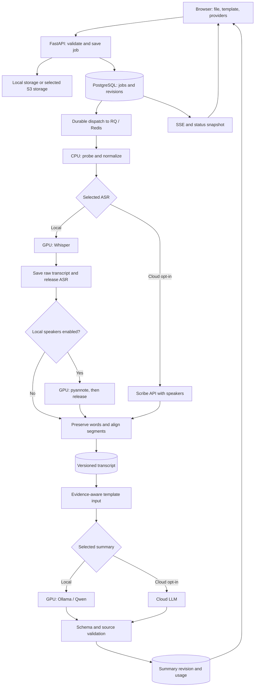

# สถาปัตยกรรม — Buzzle Hybrid

อัปเดต 2026-09-14: batch processing เสียง 30–60 นาที ใช้ FastAPI, RQ, Redis, PostgreSQL และ Next.js เดิม ASR/summary เลือก Local/Cloud แยกต่อ job

## ปัจจุบันกับเป้าหมาย

โค้ดปัจจุบันเป็น normalize → asr → join → summarize โดย summary ใช้ OpenRouter free เป็น default และเลือก Anthropic ได้ ไม่มี local diarization/Ollama และ Next.js app ยังไม่ครบ

แผนด้านล่างต้องพัฒนาและทดสอบ Fields/services/migrations ใหม่ยังไม่ใช่สิ่งที่ implementation รองรับแล้ว

## Pipeline เป้าหมาย

Whisper, pyannote และ Ollama อยู่ใต้ GPU ownership เดียวกัน ไม่ให้ stages ของคนละ job รันซ้อนกัน ไม่มีเส้นทางเปลี่ยน Local เป็น Cloud เพราะ OOM โดยอัตโนมัติ

## Services

| Service | บทบาท | สถานะ |
|---|---|---|
| api | validation, upload, metadata, SSE | มี; bounded upload/readiness ต้องเพิ่ม |
| worker | CPU preprocessing และ Cloud ตาม job config | มี; routing/recovery ต้องแก้ |
| worker-gpu | local stages ตามคิว GPU | มี Whisper; ขยาย coordinator |
| db / redis | durable data / delivery | มี Compose services |
| ollama | Local summary | ต้องเพิ่ม service/cache/health |
| web | Next.js | มี components; ต้องเพิ่ม app/config/service |

เริ่ม local disk storage ได้ S3/R2 เป็นทางเลือกที่มีการส่งข้อมูลออกนอกเครื่อง

## GPU scheduling

1. Job เก็บ config snapshot; retry ไม่อ่าน global default แทน provider/model เดิม
2. CPU workers ไม่โหลด GPU เอง ทุก Local stage ผ่าน coordinator/lock เดียว
3. หนึ่ง GPU worker และ local inference concurrency หนึ่ง รวม Ollama; ไม่มี request ที่ข้าม coordinator
4. ก่อน ASR ตรวจว่า Ollama unload แล้ว ก่อน summary ต้องปล่อย Whisper/pyannote แล้ว
5. ใช้ process lifecycle หรือ engine unload และตรวจคืนทรัพยากรจริง torch.cuda.empty_cache() อย่างเดียวไม่รับประกันว่า CTranslate2/Ollama คืน memory
6. Ollama เป้าหมาย: หนึ่งโมเดล หนึ่ง request, context จำกัด และ unload หลังใช้; ยังไม่ได้เพิ่ม config ลง Compose
7. OOM ให้ retry มีขอบเขต ลดโมเดล/context หรือแจ้งข้อจำกัด CPU fallback ต้องวัด RAM/time ก่อนเปิดใช้

ไฟล์ยาวต้อง bounded memory ทั้ง upload/decode/inference การแบ่งเสียงรักษา absolute offset; diarization แยกก้อนต้อง reconcile speaker ข้ามก้อน ไม่เริ่ม SPK_00 ใหม่แล้วถือว่าเป็นคนเดิม

## Job lifecycle

เป้าหมาย: uploaded → queued → normalizing → transcribing → diarizing (optional) → joining → summarizing → done

แยก readiness ของ transcript จากภาพรวม หาก diarization ล้มเหลวให้เตือนและใช้ transcript ต่อ ถ้า summary ล้มเหลวให้ retry เฉพาะ summary

- เพิ่ม outbox: commit ผล stage และ dispatch event ใน transaction เดียว แล้ว dispatcher ส่งคิว
- Atomic claim พร้อม owner/lease; running ที่ lease ยังไม่หมดห้ามรับซ้ำ
- Unique row ไม่ทำให้ remote API exactly-once เก็บ request ID/status และ reconcile เมื่อ timeout ไม่ทราบผล
- แก้เส้นทางที่เรียกขั้นถัดไปตรง ๆ เมื่อ done และ routing ที่อ่าน backend จาก settings แทน job
- SSE เป็น notification; reconnect ต้องอ่าน DB snapshot ได้
- ถ้า provider ไม่เปิด progress ให้แสดง stage/elapsed time ไม่สร้างเปอร์เซ็นต์หรือ ETA
- Cancel/delete ตั้ง tombstone ก่อนหยุดงาน และตรวจอีกครั้งก่อนเขียนผล

## Data model

| ตารางเดิม | ใช้ต่อ | เพิ่ม/แก้ตามแผน |
|---|---|---|
| media | filename/storage/language/status/asr_backend | provider/model snapshot, speaker option, transcript revision, processing choice |
| segments | start/end, speaker, model/edited text | stable identity ต่อ revision; แยก raw output จาก derived segmentation |
| words | word timestamps | ห้ามหายจาก cascade delete ตอน join; align จากคำจริง |
| summaries | template/model/payload/usage; OpenRouter เก็บ requested/actual model | provider, model revision, template/schema version, transcript revision, config hash |
| jobs | step/attempt/state/error | lease owner/expiry, request ID, cancellation และ timing |
| ใหม่: outbox | ยังไม่มี | durable dispatch/reconciliation |

OpenRouter adapter เพิ่มแล้ว: structured JSON, free-only model guard, usage และ model identity; POST สรุปใหม่หลังเปลี่ยน provider/model จะไม่ reuse cache ของ provider เดิม ดู [OpenRouter](openrouter.md)

Cache key เป้าหมายรวม media ID, transcript revision, template/version, provider/model และ generation config ต้อง migrate unique(media_id, template_id) เดิมก่อนรองรับหลายผลลัพธ์

schema.sql เป็น init สำหรับ volume ใหม่ การแก้ไฟล์นี้ไม่อัปเดต DB เดิม ต้องเพิ่ม versioned migrations และทดสอบรักษาข้อมูล

## API ปัจจุบัน

มีเส้นทางเหล่านี้ใน routers แต่ยังต้อง integration test:

| Method | Path | หน้าที่ |
|---|---|---|
| POST | /api/media | คืน media_id, storage_key และ upload object |
| PUT | /api/upload/{key} | local upload |
| POST | /api/media/{id}/start | enqueue |
| GET | /api/media และ /api/media/{id} | รายการ/สถานะ |
| GET | /api/media/{id}/events | SSE |
| GET | /api/media/{id}/segments | transcript |
| PATCH | /api/segments/{id} | แก้ข้อความ |
| GET | /api/templates | registry |
| POST | /api/media/{id}/summarize | template และ force |
| GET | /api/media/{id}/summary?template=timeline | ผลที่เลือก |
| GET | /api/media/{id}/summaries | ทุกเทมเพลต |
| DELETE | /api/media/{id} | ลบต้นฉบับ/DB; work files/cancel ต้องเพิ่ม |

Fields ใหม่: ASR provider/model, summary provider/model, diarization enabled และ explicit Cloud choice ส่วน capabilities, cancellation, playback/export ต้องเพิ่มและทดสอบ ไม่แสดง endpoint ที่ยังไม่มีเป็น quickstart

## Templates และหลักฐาน

ต่อ registry/Pydantic เดิมด้วย source_segment_ids และให้ server คำนวณ cite_ms/at_ms จากแหล่งจริง ตรวจ ID อยู่ใน media/revision เดียวกันและเวลาอยู่ใน duration

Schema/source validation ไม่พิสูจน์ว่าข้อความตรงกับหลักฐาน ต้องใช้ human rubric ด้วย ดู [templates](summary-templates.md)

## ข้อมูลและ deployment

Local mode ต้องใช้ local storage/endpoints ด้วย ตรวจ network/telemetry หลังเตรียม artifacts ก่อนอ้างว่า offline ทั้งระบบ

Cloud summary ส่งเฉพาะข้อความจำเป็นโดยผู้ใช้เลือก; Cloud ASR ส่งเสียงตามที่แจ้ง ไม่ log keys หรือ transcript ดิบ Retention demo เป้าหมาย configurable เช่น 24 ชั่วโมง พร้อมลบ work files, exports และ DB จริง

เริ่มในเครื่อง หากเปิด online ต้องเพิ่ม authentication/authorization ต่อ media, HTTPS, upload/rate limits และ secrets configuration Hosting ยังไม่เลือก Cloud inference ไม่ต้องมี GPU host แต่ยังต้องมี API/worker/storage

## Verification

ตรวจ duplicate start, crash ระหว่าง commit/dispatch, provider timeout, summary invalidation, delete while running, GPU overlap และไฟล์เกิน limit ตาม [workshop plan](workshop-plan.md)
